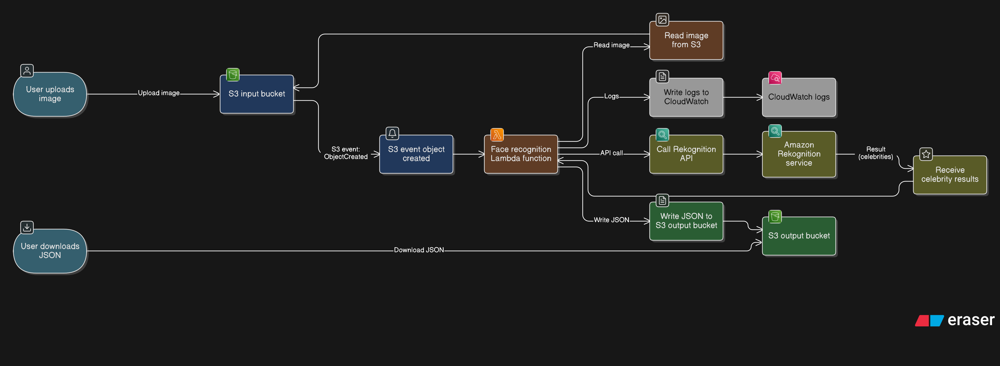

# FaceRecognition Service (M346)

Dieses Projekt wurde im Rahmen des Moduls **346 – Cloudlösungen konzipieren und realisieren** erstellt. Es demonstriert einen vollständig automatisierten Cloud-Service zur Gesichtserkennung bekannter Persönlichkeiten in AWS.

---

## Inhaltsverzeichnis

- [FaceRecognition Service (M346)](#facerecognition-service-m346)
  - [Inhaltsverzeichnis](#inhaltsverzeichnis)
  - [1. Einleitung](#1-einleitung)
  - [2. Architektur](#2-architektur)
    - [2.1 Architekturdiagramm](#21-architekturdiagramm)
  - [3. Ressourcenplanung und Konfiguration](#3-ressourcenplanung-und-konfiguration)
  - [4. Inbetriebnahme](#4-inbetriebnahme)
    - [Voraussetzungen](#voraussetzungen)
    - [Schritte](#schritte)
  - [5. Verwendung und Tests](#5-verwendung-und-tests)
  - [6. Aufgabenverteilung](#6-aufgabenverteilung)
  - [7. Persönliche Reflexion](#7-persönliche-reflexion)
    - [Reflexion Tenzin](#reflexion-tenzin)
    - [Reflexion Ivano](#reflexion-ivano)
  - [8. Quellen](#8-quellen)

---

## 1. Einleitung

Der Service ermöglicht es, Bilder über einen S3-Bucket hochzuladen, diese automatisch mittels einer serverlosen Architektur (AWS Lambda & Amazon Rekognition) zu analysieren und die Ergebnisse strukturiert als JSON-Datei zu speichern.

Das Ziel des Projekts ist die vollständige Automatisierung der Infrastruktur (Infrastructure as Code Ansatz via CLI) sowie eine lückenlose Dokumentation und Versionierung im Git-Repository.

---

## 2. Architektur

Der Service nutzt eine ereignisgesteuerte Architektur:

- **Client / Test-Script**: Lädt Bilder hoch und lädt Ergebnisse herunter.
- **S3 In-Bucket**: Speichert Bilder und löst bei jedem Upload im Ordner `uploads/` ein **S3-Event** aus.
- **AWS Lambda-Funktion**: Wird durch das Event gestartet, liest das Bild ein und ruft den Rekognition-Dienst auf.
- **Amazon Rekognition**: Identifiziert Prominente (Recognizing celebrities) und liefert Namen sowie Confidence-Werte.
- **S3 Out-Bucket**: Speichert das Analyseergebnis als JSON-Datei im Ordner `results/`.
- **CloudWatch Logs**: Protokolliert die Ausführungen der Lambda-Funktion zur Fehlerdiagnose.

### 2.1 Architekturdiagramm


---

## 3. Ressourcenplanung und Konfiguration

Folgende Ressourcen werden durch das `init.sh` Skript vollautomatisch im AWS Learner-Lab erstellt:

- **S3 Buckets**:
  - In-Bucket: `m346-face-recognition-in-[ACCOUNT-ID]`
  - Out-Bucket: `m346-face-recognition-out-[ACCOUNT-ID]`
- **Lambda-Funktion**:
  - Name: `m346-face-recognition`
  - Runtime: **Python 3.9**
  - Trigger: S3 `ObjectCreated:*` mit Prefix `uploads/`
- **IAM-Berechtigungen**: Verwendung der `LabRole` für den Zugriff auf S3 und Rekognition.

---

## 4. Inbetriebnahme

Die Bereitstellung erfolgt vollständig über die Kommandozeile.

### Voraussetzungen

- AWS Learner Lab mit gültigen Credentials.
- Konfigurierte AWS CLI (`aws configure`).
- Bash-kompatible Umgebung (Linux, macOS oder WSL).

### Schritte

1. Repository klonen und in das Verzeichnis wechseln:

   ```bash
   git clone <repository-url>
   cd <repository-name>
   ```

2. Initialisierungs-Script ausführbar machen und ausführen:
   ```bash
   chmod +x scripts/init.sh
   ./scripts/init.sh
   ```

Das Script installiert alle Komponenten, setzt Berechtigungen und konfiguriert den S3-Trigger vollautomatisiert.

## 5. Verwendung und Tests

Ein automatisierter Test prüft die Funktionsfähigkeit des Dienstes:

1. Ein Testbild einer bekannten Person unter `test/test.jpg` bereitstellen.
2. Test-Script starten:
   ```bash
   chmod +x scripts/test.sh
   ./scripts/test.sh
   ```

Das Script lädt die Datei hoch, wartet auf die Verarbeitung durch AWS Rekognition (Polling) und lädt das Ergebnis als JSON-Datei herunter.
Detaillierte Protokolle und Screenshots finden sich in der Datei [testing.md](docs/testing.md).

## 6. Aufgabenverteilung

Die Aufgaben wurden sinnvoll auf die Projektmitglieder aufgeteilt:

- **Tenzin:** Entwicklung der CLI-Skripte (init.sh, test.sh), Automatisierung der Infrastruktur und Implementierung der Lambda-Funktion in Python.

- **Ivano:** Erstellung der technischen Dokumentation, Durchführung der Testreihen und Protokollierung in Markdown.

Hinweis: Die individuellen Beiträge und die zeitliche Abfolge der Arbeiten sind über die Commit-History im Repository detailliert nachvollziehbar.

## 7. Persönliche Reflexion

### Reflexion Tenzin

Positiv: Die Arbeit hat mein Verständnis für ereignisgesteuerte Cloud-Architekturen vertieft. Die Automatisierung mit Bash-Skripten war sehr lehrreich, da ich lernte, wie man API-Antworten direkt verarbeitet. Verbesserung: Bei zukünftigen Projekten würde ich auf Infrastructure-as-Code Tools wie Terraform setzen, um Ressourcen-Abhängigkeiten noch sauberer zu verwalten und Race-Conditions beim Erstellen der Trigger zu vermeiden.

### Reflexion Ivano

Positiv: Die Erstellung der Dokumentation hat verdeutlicht, wie wichtig Nachvollziehbarkeit in Cloud-Projekten ist. Das Testprotokoll zeigt die Stabilität unseres Services unter realen Bedingungen. Verbesserung: Ich würde das Test-Script künftig um eine automatische Validierung der JSON-Struktur erweitern, um die Qualitätssicherung weiter zu erhöhen und manuelle Prüfschritte zu reduzieren.

## 8. Quellen

1. AWS Rekognition – Recognizing Celebrities  
   https://docs.aws.amazon.com/rekognition/latest/dg/celebrities.html

2. AWS Lambda – Developer Guide  
   https://docs.aws.amazon.com/lambda/latest/dg/welcome.html

3. Amazon S3 – Event Notifications  
   https://docs.aws.amazon.com/AmazonS3/latest/userguide/NotificationHowTo.html

4. AWS CLI – Command Line Interface Reference  
   https://docs.aws.amazon.com/cli/latest/reference/

5. Serverless Architecture on AWS  
   https://aws.amazon.com/serverless/

6. AWS IAM – Roles and Permissions  
   https://docs.aws.amazon.com/IAM/latest/UserGuide/id_roles.html

7. Eraser – Diagram and Whiteboard Tool  
   https://www.eraser.io/

8. Projektauftrag Modul 346, gbssg.ch, 2025

9. Jeff Bezos – Beispielbild  
   https://image.capital.de/31027178/t/pO/v1/w960/r0/-/bezos-final-0404-jpg.jpg
