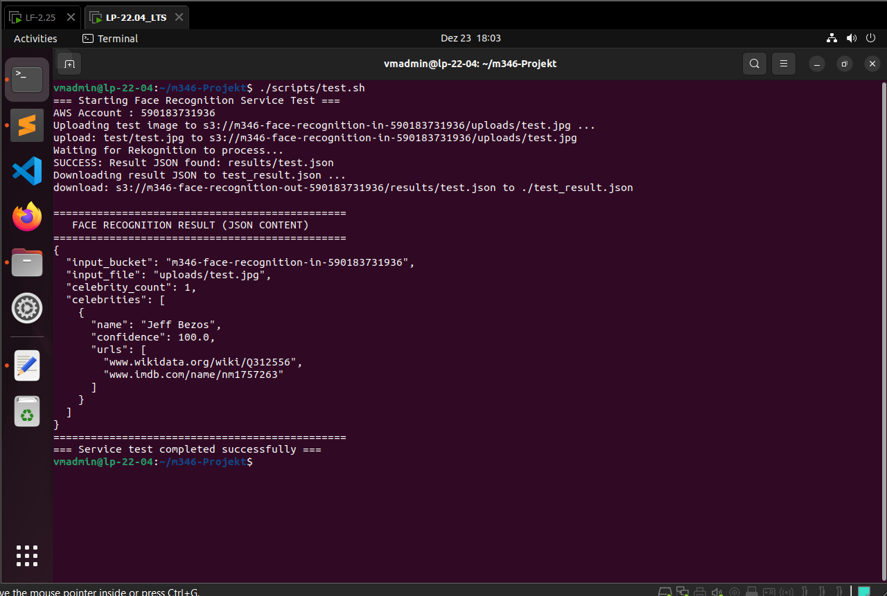
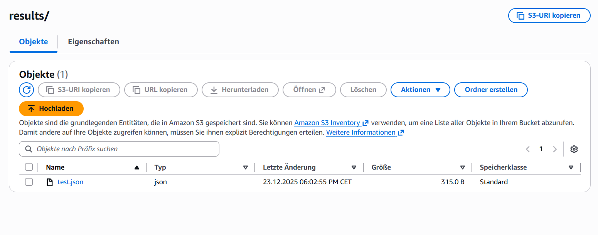
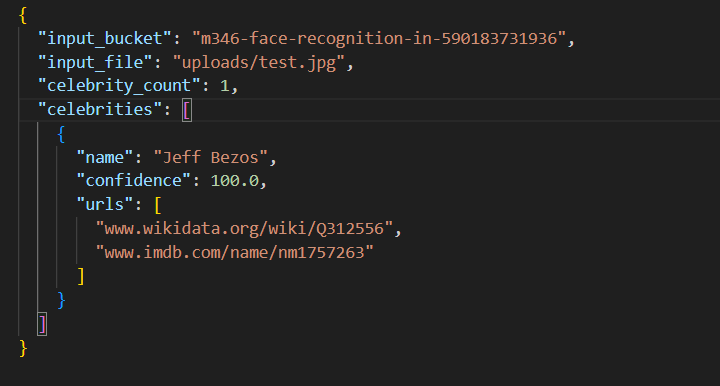

# Testprotokoll – Face Recognition Service (M346)

**Datum:** 23. Dezember 2025  
**Tester:** Ivano Pervan  
**Modul:** Modul 346 – Cloudlösungen konzipieren und realisieren  

---

## 1. Einleitung
Dieses Dokument beschreibt und protokolliert die durchgeführten Tests des Face Recognition Services.  
Ziel der Tests ist die Überprüfung, ob der Service Bilder automatisiert verarbeitet, bekannte Persönlichkeiten korrekt erkennt und die Analyseergebnisse zuverlässig als JSON-Dateien in einem AWS S3-Bucket speichert.

Der Fokus liegt dabei auf:
- der End-to-End-Funktionalität,
- der korrekten Auslösung der AWS Lambda-Funktion,
- sowie der Persistenz und Struktur der generierten Resultate.

---

## 2. Testfall 1: Automatische Erkennung (End-to-End)

| Leitfrage | Erfüllungsgrad & Resultat |
| :--- | :--- |
| **ID** | TF-01 |
| **Testgegenstand** | Vollautomatischer Erkennungsdienst via `test.sh` |
| **Testzeitpunkt** | 23.12.2025, ca. 18:00 Uhr |
| **Erwartetes Ergebnis** | Das Testbild wird in den S3-Upload-Bucket hochgeladen. Die Lambda-Funktion wird ausgelöst, analysiert das Bild mit AWS Rekognition und speichert das Resultat als JSON-Datei im Out-Bucket. |

### Durchführung
1. Ein lokales Testbild (`test/test.jpg`) wurde im Projektverzeichnis bereitgestellt.
2. Das automatisierte Test-Script wurde über das Terminal gestartet:  
   `./scripts/test.sh`
3. Das Script führte den Upload in den definierten S3-Bucket durch, wartete mittels Polling auf die Verarbeitung und lud anschliessend die generierte JSON-Ergebnisdatei automatisch herunter.

### Ergebnis
**Status: Bestanden.**  
Die Lambda-Funktion wurde korrekt ausgelöst und das Analyseergebnis erfolgreich im Out-Bucket gespeichert.

### Protokollierung & Screenshots
**Screenshot 1:**  
Terminal-Ausgabe von `./scripts/test.sh`. Zu sehen sind der erfolgreiche Upload des Bildes sowie die Bestätigung, dass die entsprechende JSON-Datei im Out-Bucket gefunden wurde.

---

## 3. Testfall 2: Validierung der Trigger-Logik (Präfix-Filter)

| ID | Beschreibung | Resultat |
| :--- | :--- | :--- |
| TF-02 | Upload einer Datei in ein Verzeichnis ausserhalb von `uploads/`. | Die Lambda-Funktion wird nicht ausgelöst; es wird kein JSON-Resultat erstellt. |

### Ergebnis
**Status: Bestanden.**  
Der konfigurierte S3-Trigger reagiert ausschliesslich auf Uploads im definierten Pfad `uploads/`. Dadurch werden unnötige Lambda-Aufrufe verhindert und Betriebskosten reduziert.

---

## 4. Testfall 3: Persistenz und Dateiformat

| ID | Beschreibung | Resultat |
| :--- | :--- | :--- |
| TF-03 | Prüfung, ob das Ergebnis im korrekten JSON-Format im Out-Bucket gespeichert wird. | Die Datei wird korrekt gespeichert und entspricht der definierten JSON-Struktur. |

### Ergebnis
**Status: Bestanden.**  
Die erzeugte JSON-Datei ist vollständig, valide und eindeutig dem verarbeiteten Bild zuordenbar.

### Protokollierung & Screenshots
**Screenshot 2:**  
Ansicht der AWS S3 Console mit dem Out-Bucket und der automatisch generierten Ergebnisdatei.

**Screenshot 3:**  
Darstellung des Inhalts der JSON-Datei mit dem erkannten Namen der Persönlichkeit und dem Confidence-Wert.

---

## 5. Fazit & Empfehlungen
Die durchgeführten Tests bestätigen, dass der Face Recognition Service stabil, zuverlässig und gemäss Projektauftrag funktioniert.

- **Automatisierung:** Die Initialisierung (`init.sh`) sowie die Testausführung (`test.sh`) verliefen vollständig automatisiert und ohne Fehler.
- **Funktionalität:** Die Erkennung prominenter Persönlichkeiten mittels AWS Rekognition ist präzise und reproduzierbar.
- **Struktur:** Alle Skripte, Konfigurationsdateien und Testergebnisse sind sauber strukturiert und versioniert im Git-Repository abgelegt.

**Empfehlung:**  
Für zukünftige Erweiterungen wird empfohlen, eine zusätzliche Fehlerbehandlung für Bilder ohne erkennbare Gesichter zu implementieren, um leere oder unvollständige JSON-Dateien zu vermeiden und die Robustheit des Services weiter zu erhöhen.
